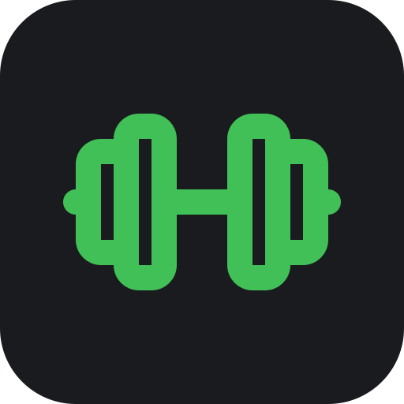
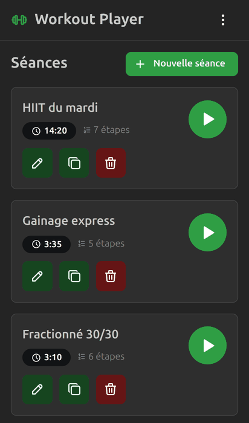
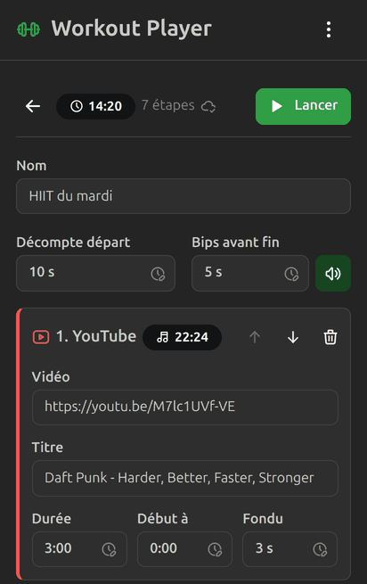
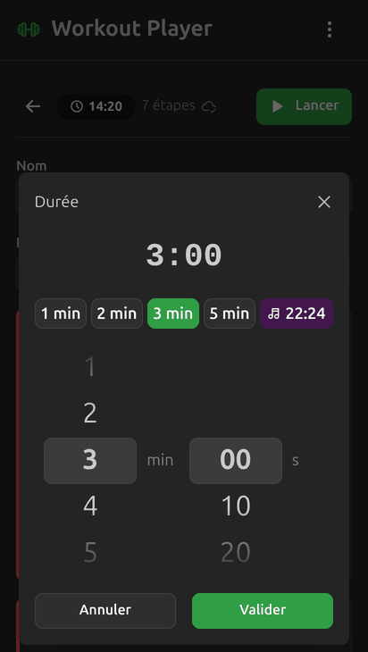
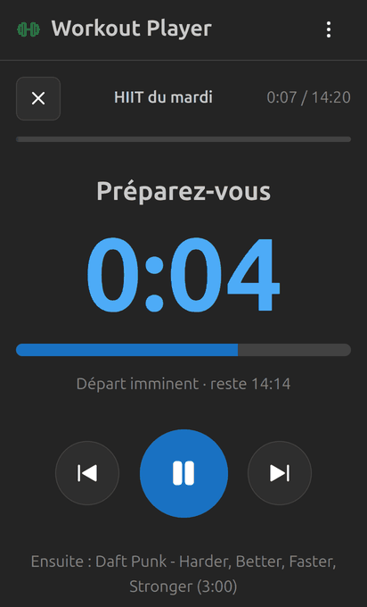

  

<h1 align="center">Workout Player</h1>

  <b>Ta musique, ton rythme, ta séance.</b> 
  Le lecteur qui enchaîne tes morceaux préférés au chrono près, avec pauses et bips de décompte.

  <a href="https://app.workout.stemux.fr"><b>Ouvrir l'application</b></a>
  ·
  <a href="#installer-sur-ton-téléphone">L'installer sur ton téléphone</a>
  ·
  

---

Tu fais du HIIT, du fractionné, du gainage ou du circuit training ? Tu connais le problème : l'œil rivé sur
le chrono, le téléphone à déverrouiller entre deux séries, la playlist qui ne tombe jamais au bon moment.

**Workout Player fait le chrono à ta place.** Tu construis ta séance une fois (« 3 min de ce morceau,
20 s de pause, puis 5 min de celui-là… »), tu appuies sur Lancer, et tu n'as plus qu'à transpirer.

  
  
  
  

## Ce qu'il sait faire

- **Tes morceaux, découpés au chrono.** Chaque étape joue un morceau pendant la durée choisie, à partir du
  passage que tu veux (le refrain qui envoie, pas l'intro de 40 secondes), avec un fondu en fin d'étape.
- **Pauses et décomptes.** Un décompte avant le départ, des pauses entre les exercices et des bips
  rythmés avant chaque changement : tu sais que ça tourne sans regarder l'écran.
- **YouTube et YouTube Music.** Colle un lien de vidéo ou importe une playlist entière. Avec ton
  abonnement Premium, pas de pub au milieu de la dernière série.
- **Tes propres fichiers.** Ajoute tes MP3 : ils restent sur le téléphone et fonctionnent hors ligne,
  même écran éteint.
- **Rapide à construire.** Durées en un geste (presets 1, 2, 3, 5 min ou roues façon réveil),
  titre « Artiste - Titre » retrouvé automatiquement, alerte si le morceau est plus court que l'étape.
- **Toujours sous les yeux.** Durée totale de la séance, temps restant, morceau suivant, gros boutons
  faciles à viser avec les mains moites.
- **Rien à enregistrer.** Chaque modification est sauvegardée automatiquement.
- **À ton goût.** Thème clair, sombre ou selon le système, et couleur d'accent au choix.

## Exemple

Un HIIT de 14 minutes :

| Étape | Durée |
|---|---|
| Décompte de départ | 10 s |
| Daft Punk - Harder, Better, Faster, Stronger | 3:00 |
| Pause | 0:20 |
| The Prodigy - Firestarter | 3:00 |
| Pause | 0:20 |
| Queen - Don't Stop Me Now (à partir de 0:30) | 5:00 |
| Pause | 0:30 |
| Survivor - Eye of the Tiger | 2:00 |

Tu crées la séance une fois, puis c'est un seul bouton à chaque entraînement.

## Installer sur ton téléphone

Workout Player est une application web installable, sans store ni compte :

- **Android (Chrome)** : ouvre [app.workout.stemux.fr](https://app.workout.stemux.fr), menu ⋮ puis
  « Installer l'application ».
- **iPhone (Safari)** : ouvre le site, bouton Partager puis « Sur l'écran d'accueil ».

Elle s'ouvre ensuite en plein écran comme une vraie app et garde l'écran allumé pendant la séance.

## Bon à savoir

- Pour profiter de YouTube Premium, connecte-toi à YouTube dans le même navigateur.
- Les playlists doivent être publiques ou non répertoriées (les playlists privées, comme « J'aime »,
  ne sont pas lisibles par le lecteur intégré). Certains clips interdisent la lecture hors de YouTube :
  le lecteur le signale et le chrono continue.
- Avec YouTube, l'écran doit rester allumé (l'app s'en charge). Avec tes fichiers, pas besoin.

## Vie privée

Pas de compte, pas de pub, pas de pistage. Tes séances et tes fichiers restent sur ton appareil.
Seul le lecteur YouTube communique avec Google quand tu l'utilises.
Détails dans les [mentions légales](docs/LEGAL.md).

## Contribuer

Idées, bugs, envies : ouvre une [issue](https://github.com/wollanup/workout-player/issues).
Pour lancer le projet en local et comprendre son architecture, voir la
[documentation technique](docs/DEVELOPMENT.md).

## Licence

[MIT](LICENSE). Les bibliothèques utilisées et leurs licences sont listées dans
[THIRD_PARTY_LICENSES.md](THIRD_PARTY_LICENSES.md).

Workout Player n'est pas affilié à YouTube ni à Google.
